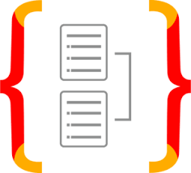

<h1 align="left">Express + TypeScript</h1>

###

<h3 align="left">🛠 語言套件</h3>

###

<div align="left">
  
  
  
  
  
  
  
  
  
  
  
  
  
</div>

###

<h3 align="left">🛠 推薦工具</h3>

###

<div align="left">
  
</div>

###

<h3 align="left">📜資料夾結構</h3>

```text
express-ts
│  .env.development
│  .gitignore
│  MEMO.txt
│  package-lock.json
│  package.json
│  README.md
│  tsconfig.json
│
├─.vscode
│      settings.json
│
├─etc
│      typeorm.png
│      typeorm2.png
│
└─src
    │  app.ts
    │  data-source.ts
    │  routes.ts
    │
    ├─api
    │      getLineOauthVerify.ts
    │      interface.ts
    │
    ├─controller
    │  ├─epilepsy
    │  │      EpilepsyController.ts
    │  │
    │  ├─liff
    │  │      LiffController.ts
    │  │
    │  └─test
    │          TestController.ts
    │
    ├─entity
    │      BodyParts.ts
    │      EpilepsyRecords.ts
    │
    ├─public
    │  └─assets(靜態資源檔目錄)
    │
    ├─types
    │      environment.d.ts
    │
    ├─utils
    │      envConfig.ts
    │      http.ts
    │
    └─views
        │  index.ejs
        │
        ├─epilepsy
        │      index.ejs
        │
        └─liff
                compact.ejs
                full.ejs
                tall.ejs
```

###

- .